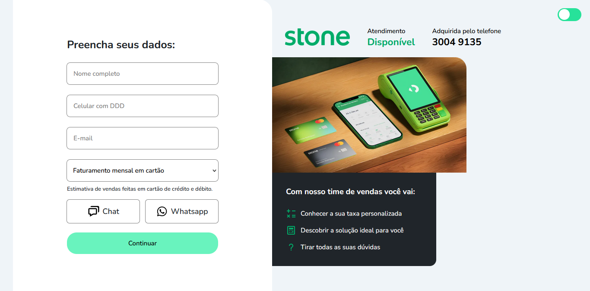

# 📑Validação de Formulário

    <a href="#status"> Status </a>&nbsp;&nbsp;
    <a href="#sobre"> Sobre </a>&nbsp;&nbsp;
    <a href="#softwares"> Tecnologias </a>&nbsp;&nbsp;
    <a href="#acesso"> Acesso </a>&nbsp;&nbsp; 
    <a href="#autor"> Autor </a>&nbsp;&nbsp; 
    <a href="#contato"> Contato</a>&nbsp;&nbsp; 
    <a href="#licenca"> Licença </a>&nbsp;&nbsp; 

<h4 align="center" id="status"> Status do projeto: Concluído ✅ </h3>

<h2 id="sobre"> 🔎 Sobre o projeto </h2>

 Projeto com foco na criação de um validador de formulários em JavaScript, onde também foi utilizado HTML e CSS para estruturação e estilização da página respectivamente, tendo seu layout baseado no da Stone. Dentro da aplicação, foram inseridos:

<ul>
    <li>Validação dos campos do formulário, frisando regras para o usuário colocar dados coerentes para posteriormente ter seu cadastro bem sucedido; </li>
    <li>Responsividade, deixando o site mais acessível para uso em outros dispositivos (celular, tablet...);</li>
    <li>Modo Light/Dark Theme, permitindo que o usuário possa escolher entre o tema claro/escuro; </li>
</ul>

    

 

<h2 id="softwares"> 💻 Tecnologias utilizadas </h2>
✅ <a target="_blank" href="https://developer.mozilla.org/pt-BR/docs/Web/HTML">HTML5</a> 
✅ <a target="_blank" href="https://developer.mozilla.org/pt-BR/docs/Web/CSS">CSS3</a> 
✅ <a target="_blank" href="https://developer.mozilla.org/pt-BR/docs/Web/JavaScript">JavaScript</a>
 

<h2 id="acesso"> 🌐 Maneira de acesso </h2>

 É possível acessar o projeto através do link:<a href="https://lukeyusuke.github.io/validador-form-js/"> https://lukeyusuke.github.io/validador-form-js/ </a>
 

<h2 id="autor"> 👦🏾 Autor </h2>

    

**Criado e desenvolvido por [Luke Yusuke](https://www.linkedin.com/in/lukeyusuke/).**

 

<h2 id="contato"> 📱 Contato </h2>

    
   &nbsp;&nbsp;&nbsp;&nbsp;&nbsp;
  
   &nbsp;&nbsp;&nbsp;&nbsp;&nbsp;
  

 

<h2 id="licenca"> 📄 Licença </h2>
O projeto faz uso da Licença<a href="https://github.com/lukeyusuke/validador-form-js/blob/main/LICENSE.md"> MIT</a>
 

  &#129145;&nbsp;<a href="#topicos"><strong>Voltar ao topo</strong></a>&nbsp;&#129145;

